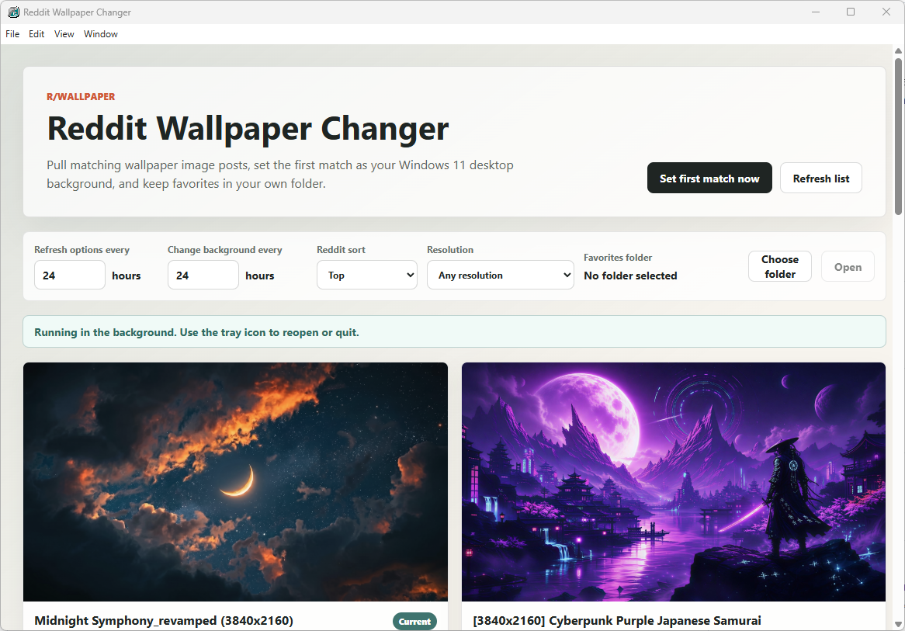

# Reddit Wallpaper Changer

A small cross-platform Electron app for Windows, Linux, and macOS that:

- Pulls 10 matching image posts from `https://www.reddit.com/r/wallpaper/`
- Lets you choose Reddit sorting: Best, Hot, New, Top, or Rising
- Filters loaded wallpapers by common screen resolutions or your current screen
- Sets the first matching image as your desktop background
- Refreshes the 10 wallpaper options on a configurable interval, defaulting to every 24 hours
- Changes your desktop background through the loaded wallpaper options on a separate configurable interval, defaulting to every 24 hours
- Prevents either interval from being set below 1 hour
- Can optionally start automatically when you sign in and stay hidden in the tray/menu bar
- Lets you favorite any shown wallpaper into a folder you choose
- Keeps running in the background from the tray/menu bar after closing or minimizing
- Includes app icon files in `assets/` for the window, tray, and packaging



## Platform support

Wallpaper changing is supported on:

- **Windows** through the native `SystemParametersInfo` API.
- **Linux** through common desktop-environment tools available on Arch Linux and Debian Linux, including GNOME/GSettings, Cinnamon, MATE, KDE Plasma (`qdbus6`/`qdbus`, with `gdbus`/`busctl` fallbacks), XFCE (`xfconf-query`), and PCManFM/PCManFM-Qt.
- **macOS** through AppleScript/System Events.

Startup behavior is also platform-aware:

- Windows and macOS use Electron login item settings with the `--hidden` launch argument.
- Linux writes a freedesktop autostart entry to `~/.config/autostart/reddit-wallpaper-changer.desktop` with the `--hidden` launch argument.
- Launches with `--hidden`, `--startup`, or OS login-item startup stay hidden in the tray/menu bar until you choose **Show Reddit Wallpaper Changer**.

## Build packages

Install dependencies first:

```bash
npm install
```

Build packages for the current platform or specific targets:

```bash
npm run dist
npm run dist:win
npm run dist:linux
npm run dist:mac
```

Linux builds produce AppImage, Debian (`.deb`), and Arch Linux (`.pacman`) packages. macOS builds produce DMG and ZIP packages. Windows builds produce an NSIS installer.

## Notes

- On Linux, the app detects your current desktop environment before trying wallpaper setters. This prevents KDE Plasma systems (including Arch-based distributions such as CachyOS) from reporting success through GNOME/GSettings commands that do not actually change the Plasma wallpaper.

- The first refresh runs when the app starts and sets the first matching image.
- Closing or minimizing the window hides it to the tray/menu bar so scheduled wallpaper refreshes and background changes continue. Use the tray/menu bar icon to reopen the window or quit the app.
- Use **Set first match now** to fetch the selected Reddit sort and immediately apply the first matching image.
- Changing the Reddit sort or resolution refreshes the list using the new filter.
- Use **Choose folder** before favoriting, or the app will ask you to choose one when you favorite your first wallpaper.
